# Viktora Threshold — User Guide

*The complete tour: setup, the widget, capture, Today, the Log, Settings, and
what everything on screen means. All screenshots are the real app (2026-07-06
build, v0.9.x) rendered against a live workspace.*

---

## 1. What Threshold is

Threshold is a small always-on-top desktop companion for your Apolla workspace.
It does two jobs:

1. **Capture** — get things *into* your workspace with as little friction as
   possible: a screen region, a dropped file, a OneNote page, a Plaud
   recording, a forwarded email.
2. **Report** — surface what your workspace knows *back* to you as a morning
   report: what's waiting on you, what's coming due, what needs attention, and
   a narrative state of play — so a promise buried at the bottom of an email
   thread gets flagged *before* its deadline, not after.

It lives as a floating pill on your desktop and expands into a full window when
you want the report.

---

## 2. Install and first run

Install from the signed installer for your platform (see `PILOT-INSTALL.md`
for download and platform notes — macOS and Windows installers are signed and
notarized).

On first launch, Threshold shows a **sign-in wizard**:

- **Workspace URL** — the address of your Apolla server (your administrator
  provides this).
- **Access key** — your bearer token for that workspace.

Enter both and continue; Threshold verifies the connection and drops you at
the floating widget. You can change these later at any time in **Settings →
Connection** (section 8), which also has a *Test connection* button.

> **Tip:** if the app can't reach the server, everything still works locally —
> captures queue up and the report views show calm "nothing here yet" states.
> See section 9.

---

## 3. The widget pill

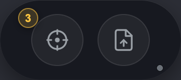

The 180×80 pill floats above your other windows, on every desktop Space. It is
deliberately calm — no idle animation; it only pulses (a single soft amber
ring) when something new needs you.

| Element | What it is | What it does |
|---|---|---|
| **Crosshair button** | Capture screen | Click, then drag a region of your screen — the capture is sent to your workspace. |
| **Document button** | Pick a file | Opens a file picker. The **whole pill is also a drop target** — drag any file onto it. The button glows green while a drop will land. |
| **Amber count, top-left** | Needs attention | The number of open, overdue-and-silent items in your log. Click it to open Today. Hidden at zero. |
| **Amber count, bottom-left** | Proxy inbox | Pending proposals awaiting your review. Click to open the inbox. Hidden at zero. |
| **Spark badge, top-right** | Preview arrived | A new tidbit/preview is ready. Click to see it. |
| **Dot, bottom-right** | Connectivity | Dim grey = unknown/disconnected (never alarming), green = connected, soft red = the server errored. |
| **Arrows, top-left corner** | Expand | Opens the full window (same as double-purpose corner slot: when the amber count is showing, it owns the corner). |

**Moving it:** drag the pill body anywhere. **Right-click** opens the menu:
Capture Screen, Pick File…, Expand…, Today, Plaud Sync Queue, OneNote actions
(send current page / send section / browse), Connections…, Settings…, Open
Console, Quit Threshold.

When the widget expands into the full window, the app becomes a first-class
citizen — it appears in the Dock, ⌘⇥, and Mission Control, and can enter
native fullscreen. Collapsing returns it to the quiet always-on-top pill, back
at the exact position you left it.

---

## 4. Capturing

Everything you capture lands in your Apolla workspace, where it's read for
decisions, commitments, owners, and due dates.

- **Screen region** — crosshair button (or right-click → Capture Screen).
- **File** — document button, or drag-and-drop onto the pill.
- **OneNote** (Windows) — press the global hotkey (default `Ctrl+Shift+O`)
  anywhere to send the OneNote page you're viewing; or use the right-click
  menu to send a page/section or browse. Configure the hotkey in Settings →
  Integrations.
- **Plaud recordings** — connect your Plaud account once (Settings →
  Integrations) and recordings sync automatically; the Plaud Sync Queue in the
  right-click menu shows progress.
- **Email** — Settings → Email capture gives you a personal capture address:
  forward or BCC a thread and its commitments enter the workspace. This is the
  cheapest way to make sure a promise made in email ("I should have something
  to share by June 30th") is *on the record* and gets flagged before it's due.
- **Outlook add-in** — capture emails and send Threshold's staged drafts
  without leaving Outlook (Settings → Integrations).

---

## 5. Today — the morning report

Click **Today** in the nav (or the amber count on the pill). This is the
centerpiece: one screen that answers *"what needs me, what's coming, where do
things stand?"*

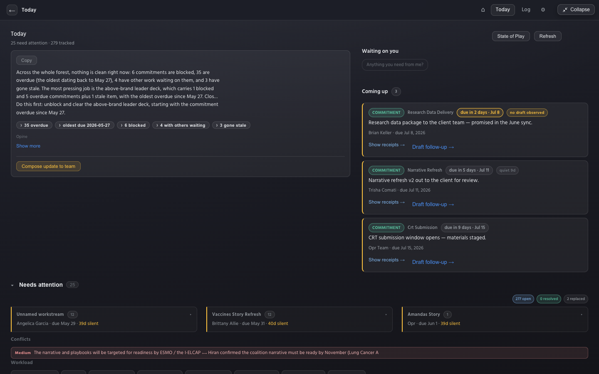

At full width the layout is **read | act**: the narrative on the left, your
action rail on the right, and the full worklist across the bottom. Every
number in it is derived from your captured record — nothing is invented.

### 5.1 State of play (the read)

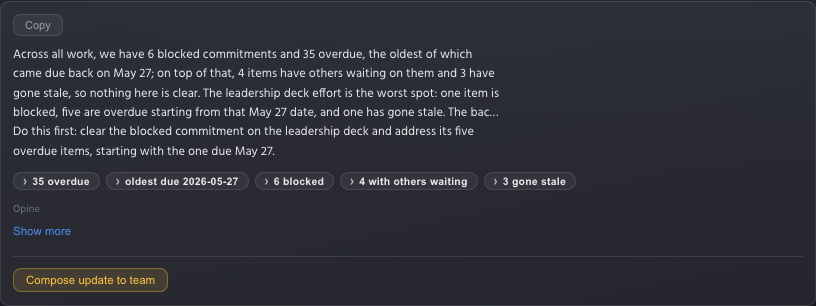

The overview panel leads with a short digest and always ends with **"Do this
first"** — the single most valuable next action, chosen from what's blocked,
overdue, and stale. Below it:

- **Chips** (`35 overdue`, `6 blocked`, …) — click any chip to drill into
  those items.
- **Show more** — expands the full narrative in place:

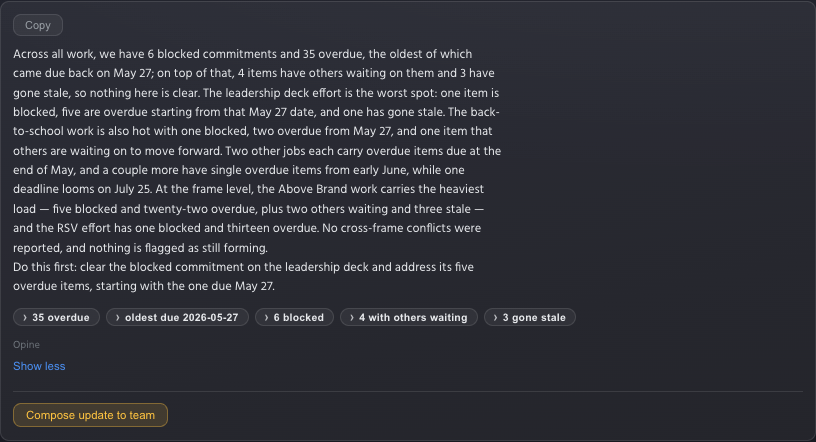

- **Copy** — puts the whole narrative on your clipboard, ready to paste into
  an email or chat.
- **Compose update to team** — drafts an outward team update from the state of
  play. Drafts are *staged*, never auto-sent (see the Awaiting-send tray).

### 5.2 Waiting on you & Coming up (the act rail)

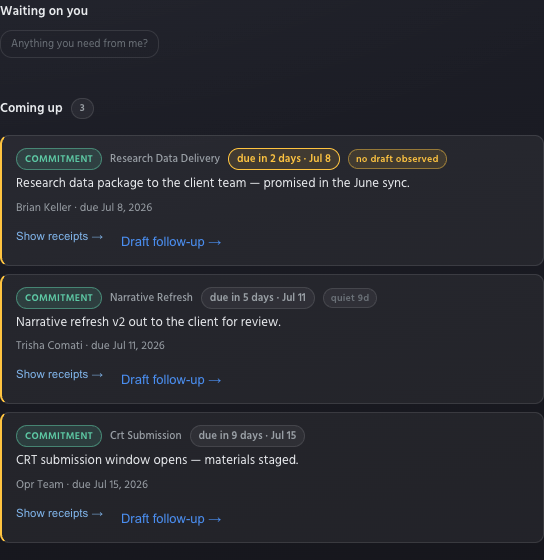

**Waiting on you** is your ratification queue: proposals filed by the system,
questions it wants to ask ("Anything you need from me?" — click it to pull
one), and chase cards for things that went quiet. Each card carries its own
**Confirm / Dismiss / Snooze** actions, with undo.

**Coming up** is the windshield — open commitments due in the next 14 days,
soonest first. The badges matter:

- **`due in 2 days · Jul 8`** — amber when due within 48 hours (the row also
  takes the amber edge).
- **`quiet 9d`** — due soon *and* nobody has touched it in 9 days. Worth a
  nudge.
- **`no draft observed`** (amber) — the strongest warning: this is due soon
  and **nothing related has moved since it was promised**. This is the flag
  designed for the "promised June 30th, nobody noticed until July 2nd" miss —
  it appears *before* the deadline, while a heads-up to the client is still
  cheap. *(Requires the readiness feature on your server; rows without it
  still show the due and quiet badges.)*

Row actions: **Show receipts →** (the verbatim evidence behind the item),
**Draft follow-up →** (stages a nudge to the item's owner into the outbox).

**Awaiting send** appears in the rail only when you have staged drafts —
review and send them from there or from the Outlook add-in; nothing ever sends
itself.

### 5.3 Needs attention (the worklist)

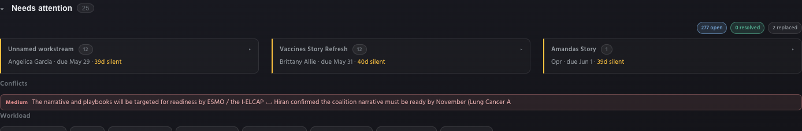

Everything open that is blocked, overdue, or gone silent, grouped by project
into compact cards — the amber left bar marks them as needing you. Each card
shows its **worst item** on one line (`owner · due date · status`): the status
word is amber for silence/overdue and soft red for blocked. Groups are ordered
by their most urgent item; within a group, blocked → oldest-overdue →
longest-silent.

Click a card to expand its rows in place:

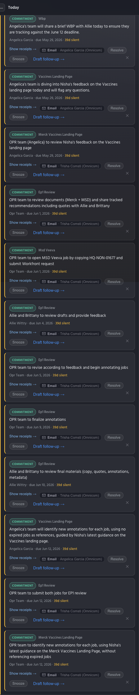

Rows carry the full toolkit: **Show receipts** (the quoted evidence and its
source), **Email** the owner, **Resolve**, **Snooze** (pick a duration),
and **✕ Dismiss** (with a reason — dismissed items stay out of your views).
Long groups show their top five with **Show all N →**.

Below the board: **Conflicts** (statements in your record that disagree) and
**Workload** (per-person open/overdue counts).

> The board appears when your Waiting-on-you queue is empty — the queue is
> always the first priority; the worklist is where you go once nothing is
> waiting on your sign-off.

### 5.4 Narrower windows and quiet mornings

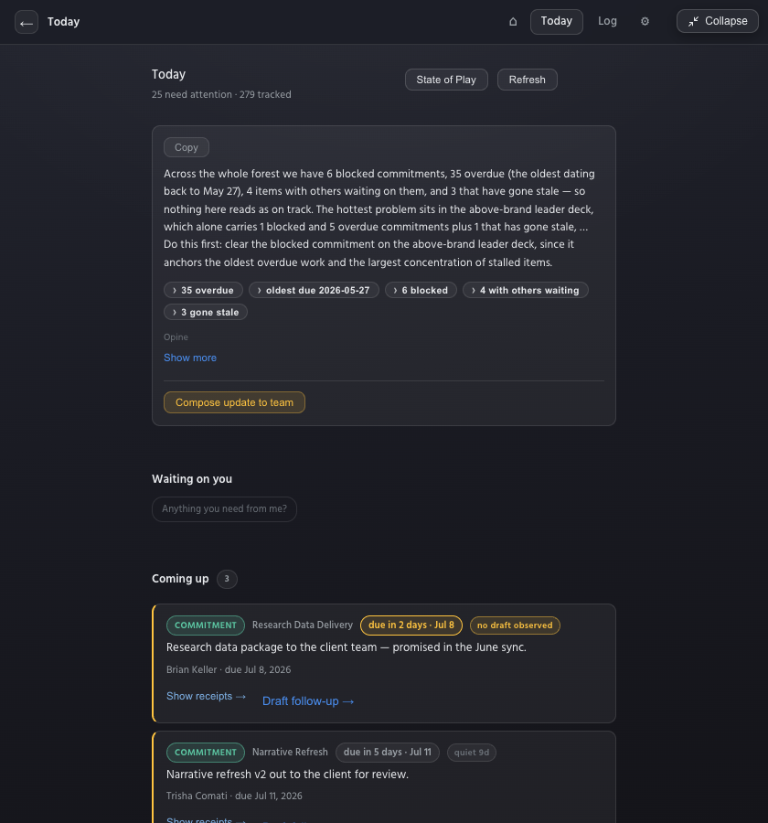

Below ~1200px everything stacks into one readable column in the same order:
state of play → waiting on you → coming up → needs attention.

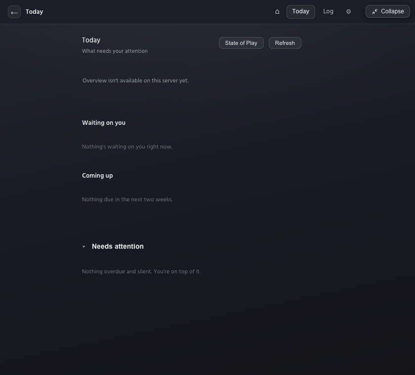

When there's nothing to report, Today says so **affirmatively** — every
section stays present with a calm line ("Nothing due in the next two weeks",
"Nothing overdue and silent. You're on top of it."). A quiet morning reads as
good news, not as a broken screen.

---

## 6. Home

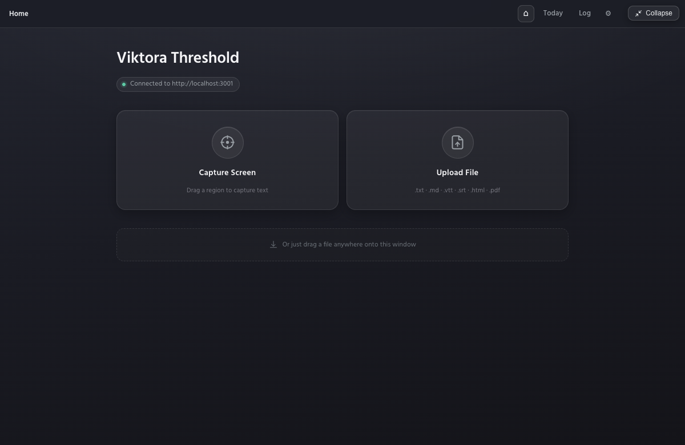

The landing surface after expanding: quick capture tiles (screen / file) and
the drop hint. Everything here is also reachable from the pill, so most days
you'll live in Today.

---

## 7. The Log

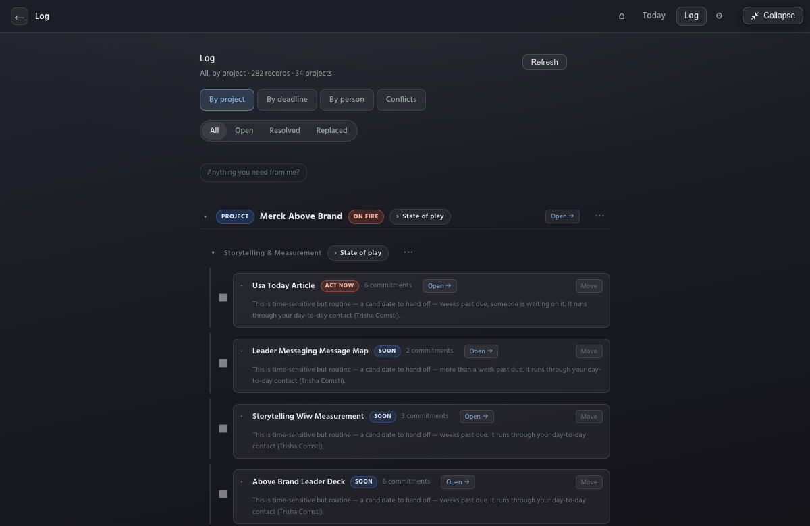

The chronological record: every decision and commitment captured, with type
chips (blue = decision, green = commitment), state pills (open / resolved /
replaced), owners, due dates, and receipts. This is where you go to answer
"when did we decide that, and where's the evidence?" — entity and project
links cross-navigate, and every claim can show its verbatim source quote.

---

## 8. Settings

Settings is a master-detail screen: sections on the left rail, details on the
right.

### Connection

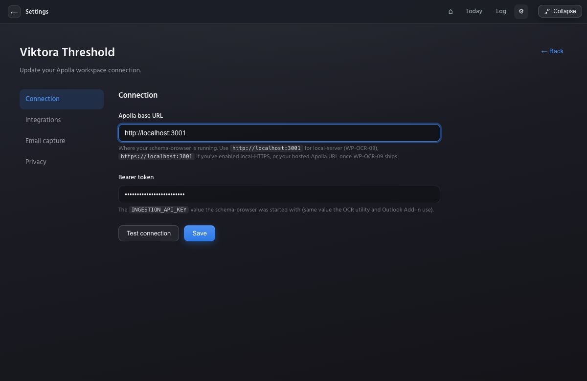

Your workspace URL and access key, with **Test connection**. Change these if
your server moves or your key rotates — the rest of the app picks the change
up immediately.

### Integrations

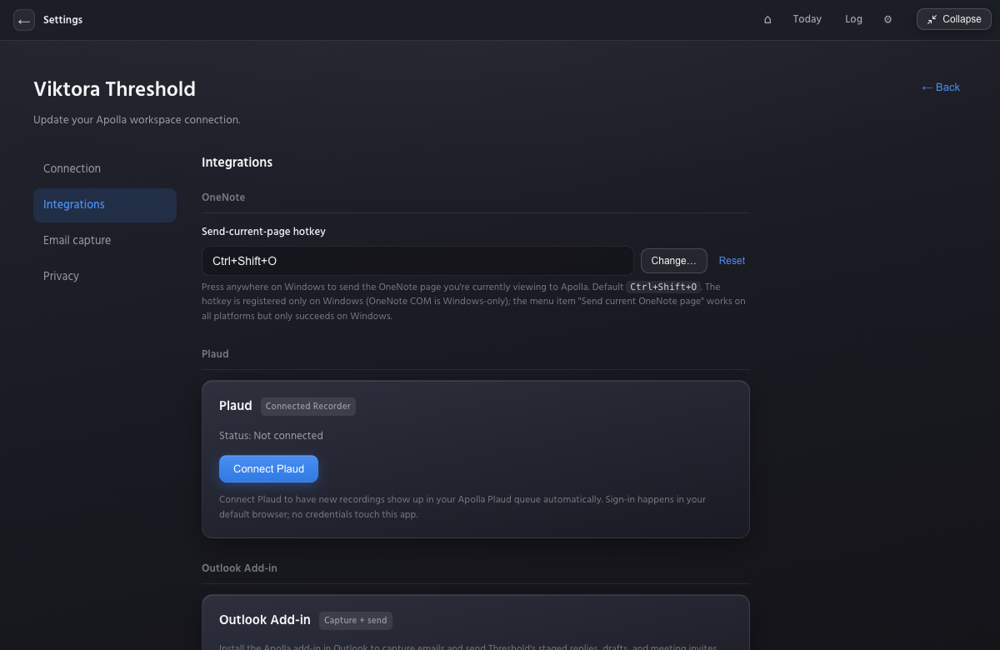

- **OneNote** — the global send-current-page hotkey (Windows; default
  `Ctrl+Shift+O`), with Change/Reset.
- **Plaud** — connect your recorder account; sign-in happens in your browser
  and no credentials touch the app. Once connected, new recordings sync
  automatically. (Note: Plaud sessions expire after ~7 days of no syncing —
  reconnect from here if the status drops.)
- **Outlook add-in** — install the add-in to capture emails and send staged
  drafts from inside Outlook.
- **Auto-import** — designate sources (Plaud, OneNote sections) to sync on a
  schedule, across restarts.

### Email capture

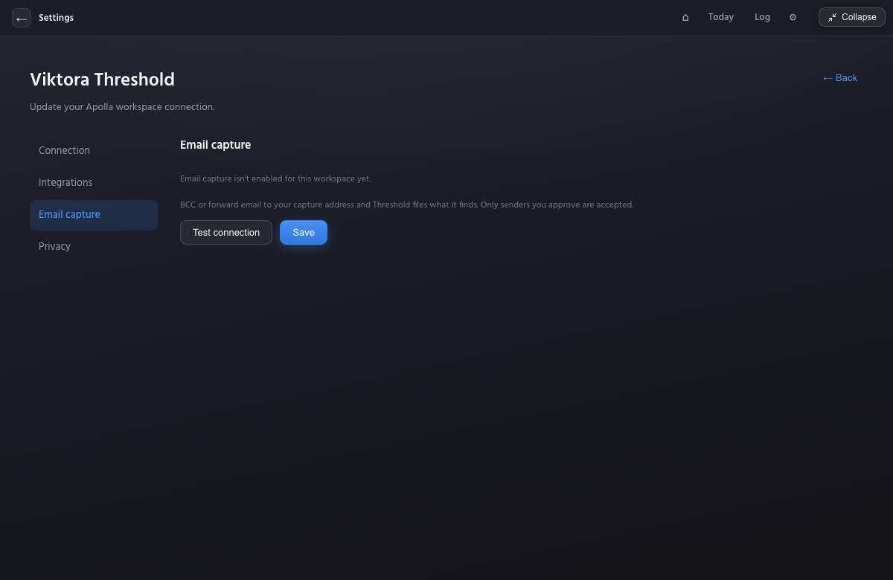

Your personal capture address, ready to copy. Forward or BCC any thread to put
its contents on the record. This is the recommended habit for client-facing
promises: if it's in Threshold, Today will warn you before it's due.

### Privacy

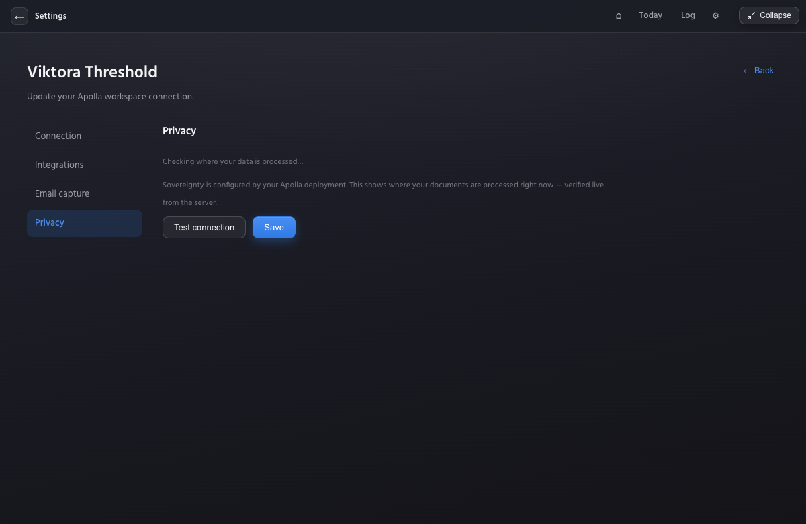

Your data-sovereignty posture: what leaves your machine and where it's
processed. Review this with your administrator.

---

## 9. When the server is unreachable

Threshold fails *calm*, never loud:

- The widget keeps working — captures queue locally and the status dot goes
  soft red (never a modal, never a red alert).
- Today and the Log show their quiet states rather than error boxes.
- Reconnection is automatic; if your key expired, Settings → Connection →
  Test connection tells you.

---

## 10. Windows, keyboard, and behaviors worth knowing

- **The pill** stays on top, on all Spaces, and never steals focus from the
  app you're working in.
- **Expanded**, Threshold behaves like any first-class app: ⌘⇥, Mission
  Control, native fullscreen, resizable (720×560 minimum). Collapse returns
  the pill to its remembered position.
- **One accent color:** amber always means *needs you* (counts, urgency
  badges, the one primary action). Everything else stays quiet by design.
- **Nothing auto-sends.** Every outbound draft (team updates, follow-ups,
  heads-ups) is staged to the outbox for your explicit review.
- **Dismiss is reversible** and asks for a reason; Snooze durations live in
  the menu; "Replaced" marks superseded records in the Log.

---

*Guide generated 2026-07-06 against the v0.9.x build. Screenshots:
`docs/user-guide-assets/`. For installation, see `PILOT-INSTALL.md`.*
