# Viktora Threshold — User Guide

*The complete tour: getting set up, the widget, capturing (including email),
Today, the Log, projects, and Settings — and what everything on screen means.
All screenshots are the real app, rendered against a live workspace.*

---

## 1. What Threshold is

Threshold is a small, always-on-top desktop companion for your Apolla
workspace. It does two jobs:

1. **Capture** — get things *into* your workspace with as little friction as
   possible: a screen region, a dropped file, a OneNote page, a Plaud
   recording, a forwarded email.
2. **Report** — surface what your workspace knows *back* to you as a morning
   report: what's waiting on you, what's coming due, what needs attention, and
   a narrative state of play — so a promise buried at the bottom of an email
   thread gets flagged *before* its deadline, not after.

It lives as a floating pill on your desktop and expands into a full window when
you want the report.

---

## 2. Getting set up

### 2.1 Install

Download the installer for your platform from the
[Releases page](https://github.com/rosscantrell/viktora-threshold/releases).
Both the macOS and Windows installers are signed and notarized, so they open
without security warnings.

- **macOS** — download the `.dmg` (Apple Silicon: `…_aarch64.dmg`), open it,
  and drag **Viktora Threshold** into Applications.
- **Windows** — download and run `…_x64-setup.exe` (recommended) or the `.msi`
  for managed IT deployment, then step through the wizard.

Full platform notes, including what to do with an older unsigned build, are in
`PILOT-INSTALL.md`.

### 2.2 Sign in

On first launch, Threshold shows a sign-in card.

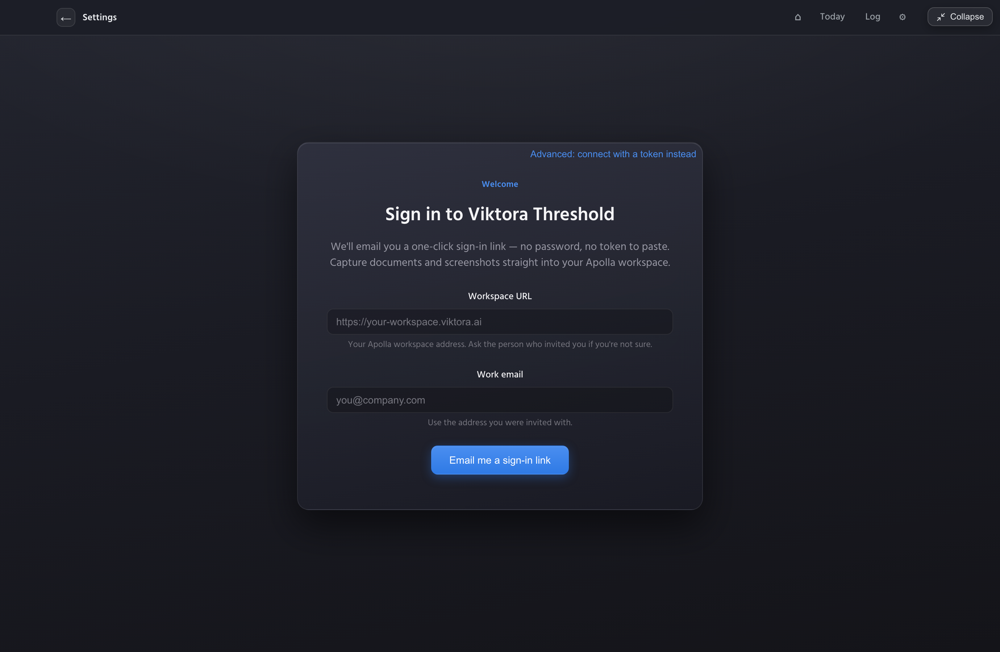

The simplest way in is a **magic link** — no password, no token to paste:

1. Enter your **Workspace URL** — the address of your Apolla workspace (ask
   the person who invited you if you're not sure).
2. Enter your **work email** — use the address you were invited with.
3. Click **Email me a sign-in link**.

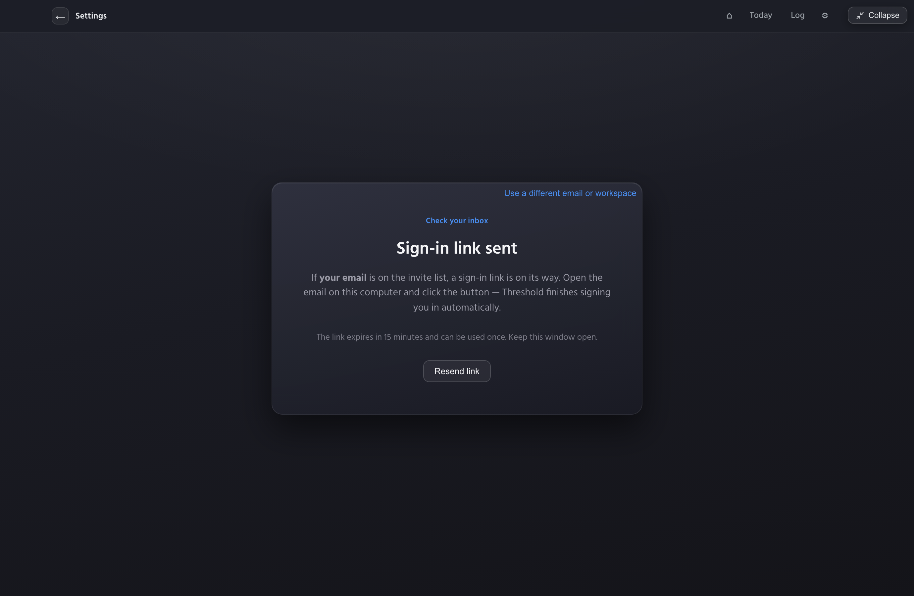

Check your inbox and click the link. Threshold verifies you and drops you at
the floating widget. Signing in with your own email also unlocks the **Mine**
filter, so Today can show just the work that's yours.

> **Prefer a token?** Click **Advanced: connect with a token instead** on the
> sign-in card to enter a Workspace URL and an access key (bearer token)
> directly. You can change either method later in **Settings → Connection**
> (section 9), which also has a **Test connection** button.

### 2.3 The widget pill

Once you're in, Threshold lives as a small pill that floats above your other
windows, on every desktop Space. It is deliberately calm — no idle animation;
it only pulses (a single soft amber ring) when something new needs you.

| Element | What it is | What it does |
|---|---|---|
| **Crosshair button** | Capture screen | Click, then drag a region of your screen — the capture is sent to your workspace. |
| **Document button** | Pick a file | Opens a file picker. The **whole pill is also a drop target** — drag any file onto it. The button glows green while a drop will land. |
| **Amber count, top-left** | Needs attention | The number of open, overdue-and-silent items in your log. Click it to open Today. Hidden at zero. |
| **Amber count, bottom-left** | Inbox | Pending proposals awaiting your review. Click to open the inbox. Hidden at zero. |
| **Spark badge, top-right** | Preview arrived | A new preview is ready. Click to see it. |
| **Dot, bottom-right** | Connectivity | Dim grey = unknown/disconnected (never alarming), green = connected, soft red = the server errored. |

**Moving it:** drag the pill body anywhere. **Right-click** opens the menu:
Capture Screen, Pick File…, Expand…, Today, Plaud Sync Queue, OneNote actions
(send current page / send section / browse), Connections…, Settings…, Open
Console, Quit Threshold.

When the widget expands into the full window, the app becomes a first-class
citizen — it appears in the Dock, ⌘⇥, and Mission Control, and can enter native
fullscreen. Collapsing returns it to the quiet always-on-top pill, back at the
exact position you left it.

---

## 3. Capturing

Everything you capture lands in your Apolla workspace, where it's read for
decisions, commitments, owners, and due dates.

- **Screen region** — crosshair button (or right-click → Capture Screen).
- **File** — document button, or drag-and-drop onto the pill.
- **OneNote** (Windows) — press the global hotkey (default `Ctrl+Shift+O`)
  anywhere to send the OneNote page you're viewing; or use the right-click menu
  to send a page/section or browse. Configure the hotkey in Settings →
  Integrations.
- **Plaud recordings** — connect your Plaud account once (Settings →
  Integrations) and recordings sync automatically; the Plaud Sync Queue in the
  right-click menu shows progress.
- **Email** — forward or BCC any thread to your personal capture address and
  its commitments enter the workspace. This is the cheapest way to make sure a
  promise made in email ("I should have something to share by June 30th") is
  *on the record* and gets flagged before it's due. Full walkthrough in
  section 4.
- **Outlook add-in** — capture emails and send Threshold's staged drafts
  without leaving Outlook (Settings → Integrations).

---

## 4. Email capture

Email capture gives you a **private address** for your workspace. Forward or
BCC any email to it and Threshold files what it finds, then replies with a
receipt. It's the recommended habit for client-facing promises: if it's in
Threshold, Today will warn you before it's due.

### 4.1 Create your capture address

Open **Settings → Email capture**.

Enter **the email address you forward from** — your own work address. This
becomes the *owner* of the capture address, so it's approved to send to it
automatically. Then click **Create my capture address**.

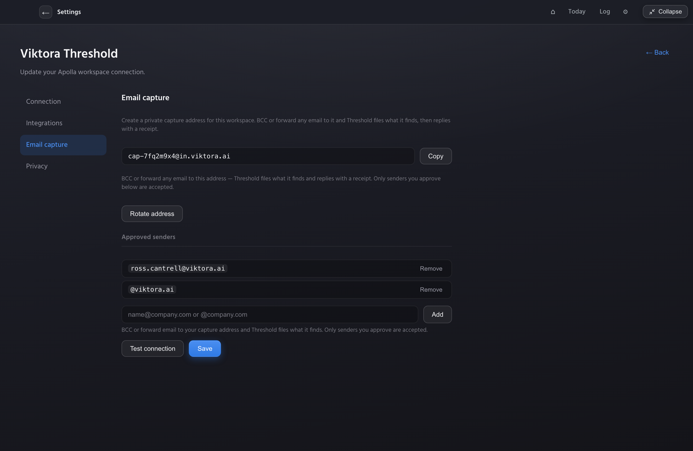

You now have a generated address like `cap-7fq2m9x4@in.viktora.ai`. Click
**Copy** to put it on your clipboard.

> **Tip:** save the address as a contact in your mail app named something like
> **"Threshold Capture."** Then forwarding is one autocomplete away, and you
> never have to remember the random string.

**Approved senders.** Only senders you approve are accepted — email from anyone
else is ignored. Add senders as either:

- a **bare email** (`name@company.com`) — that one person, or
- an **`@domain`** wildcard (`@company.com`) — anyone at that domain.

Your own forwarding address is added for you when you create the address. Use
**Rotate address** if you ever need to retire the current address and mint a
fresh one.

### 4.2 Forward an email — and read the receipt

Forward or BCC any email to your capture address. Within a minute or so,
Threshold replies to you with a **receipt** listing, verbatim, exactly what it
captured — the decisions and commitments it found, with owners and due dates.
If the message had nothing actionable in it, the receipt says so plainly
("nothing actionable found") rather than inventing something.

*[placeholder: receipt email — TODO capture a real receipt reply]*

### 4.3 Reply-commands

You can steer a capture by **replying to the receipt** (or to the original, to
your capture address) with a command as the **first standalone line** of the
reply:

- **`private`** — mark this capture as private to you.
- **`remove`** — undo the capture; pull what it filed back out.

The command must be the first line on its own — put any note to yourself below
it.

---

## 5. Today — the morning report

Click **Today** in the nav (or the amber count on the pill). This is the
centerpiece: one screen that answers *"what needs me, what's coming, where do
things stand?"*

At full width the layout is **read | act**: the narrative and the deadline
picture on the left, your action rail on the right. Every number in it is
derived from your captured record — nothing is invented.

### 5.1 State of play (the read)

The overview panel leads with a short digest and always ends with **"Do this
first"** — the single most valuable next action, chosen from what's blocked,
overdue, and stale. Below it:

- **Chips** (`34 overdue`, `6 blocked`, …) — click any chip to drill into
  those items.
- **Show more** — expands the full narrative in place:

- **Copy** — puts the whole narrative on your clipboard, ready to paste into an
  email or chat.
- **Compose update to team** — drafts an outward team update from the state of
  play. Drafts are *staged*, never auto-sent.

### 5.2 Deadline outlook (the runway)

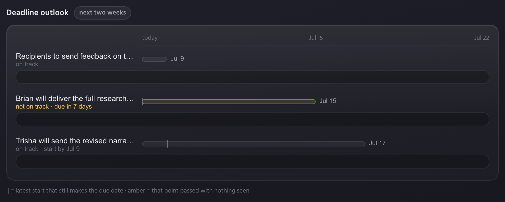

The Deadline outlook is a runway picture for everything due in the next two
weeks. One bar per commitment, laid out on a **today → due-date** axis. The
short tick mark on a bar is **the latest start that still makes the due date** —
the point by which work needs to be under way. When that point has passed with
nothing seen, the bar and its label turn **amber** and read *not on track*.
Rows that are fine read *on track*; rows nobody has touched in a while read
*quiet*.

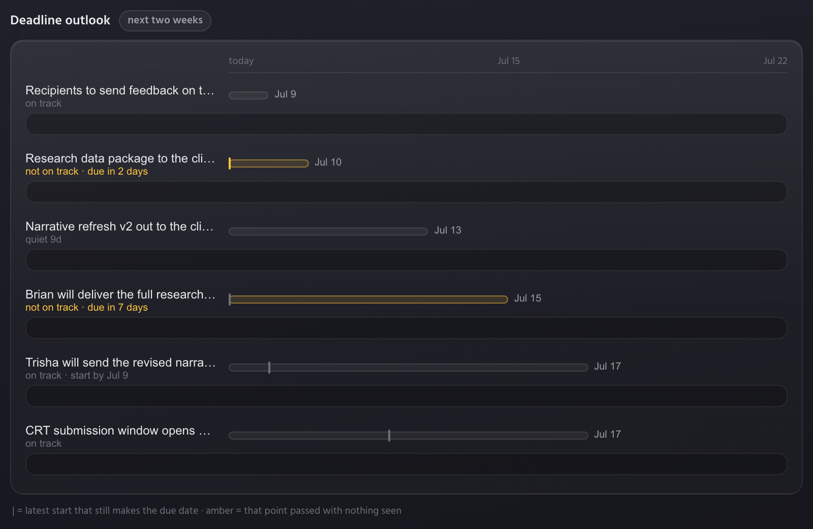

**Click any row to see the reasoning behind it:**

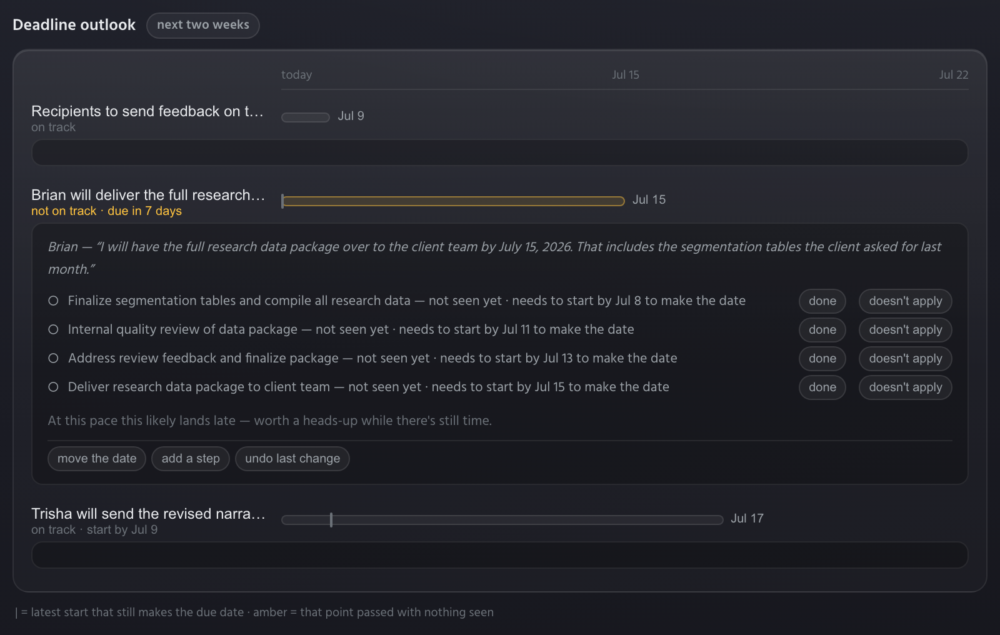

The expanded panel shows:

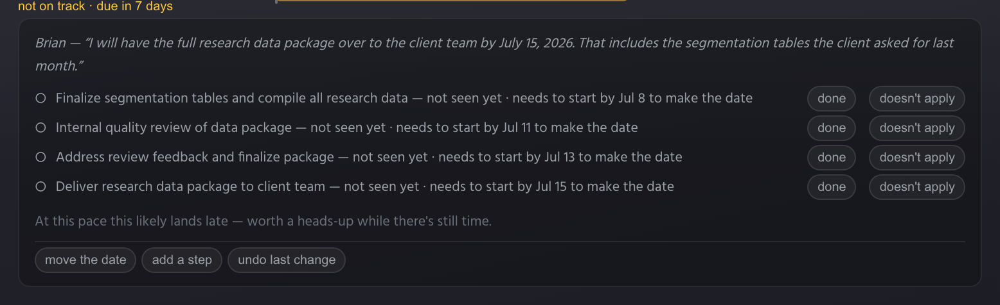

- **The promise, verbatim** — the exact line that created this deadline
  ("Brian — *I will have the full research data package over to the client team
  by July 15, 2026…*").
- **A step checklist** — the work this deadline implies, each step with the
  date it **needs to start by to make the date**. Steps not yet seen are marked
  *not seen yet*.
- **A plain closing line** — e.g. *"At this pace this likely lands late — worth
  a heads-up while there's still time."*

Every step and the row itself carry hands-on controls, so the picture stays
accurate as reality changes:

| Gesture | What it does |
|---|---|
| **done** | Mark a step as finished. |
| **doesn't apply** | Drop a step that isn't relevant here. |
| **add a step** | Add a step the plan is missing. |
| **move the date** | Change the due date. The item gets a *"moved from …"* tag that carries through to Coming up, so the history is visible. |
| **undo last change** | Reverse your last gesture. |
| **Show in Coming up →** | Jump to this item's row in the action rail. |

*(The Deadline outlook fills the left column in the wide layout. In narrower
windows the same facts live in Coming up — see section 5.6.)*

### 5.3 Waiting on you (the act rail)

**Waiting on you** is your ratification queue: proposals the system has filed,
chase cards for things that went quiet, and questions it wants you to settle.
Each card carries its own **Confirm / Dismiss / Snooze** actions, with undo.

Two question types worth knowing:

**A naming ask** — when a batch of work is grouped under a bare code with no
readable name:

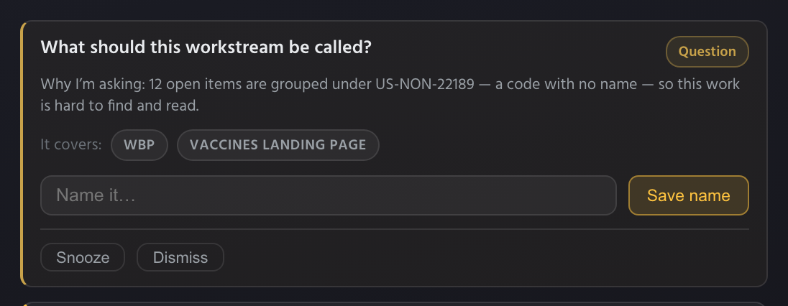

*"What should this workstream be called?"* — Threshold explains why (e.g. 12
open items are grouped under `US-NON-22189`, a code with no name, so the work
is hard to find and read), shows what the group covers, and lets you type a
name and **Save name** (or Snooze / Dismiss).

**A merge ask** — when two areas look like the same piece of work:

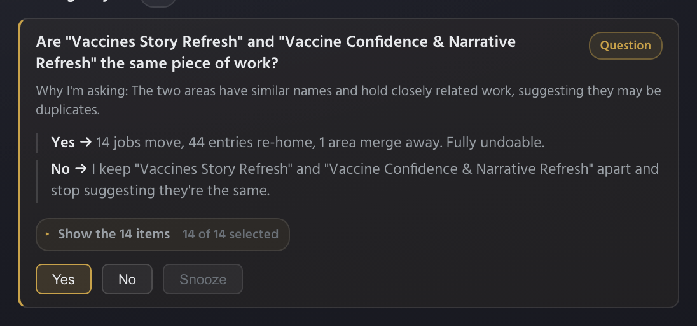

*"Are these the same piece of work?"* — with the consequences of each answer
spelled out ("**Yes →** 14 jobs move, 44 entries re-home… Fully undoable") and
a **Show the N items** expander so you can review exactly what would move before
you answer.

Any card can be dismissed; dismissed items stay out of your views.

### 5.4 Coming up (the windshield)

**Coming up** lists open commitments due in the next 14 days, soonest first.

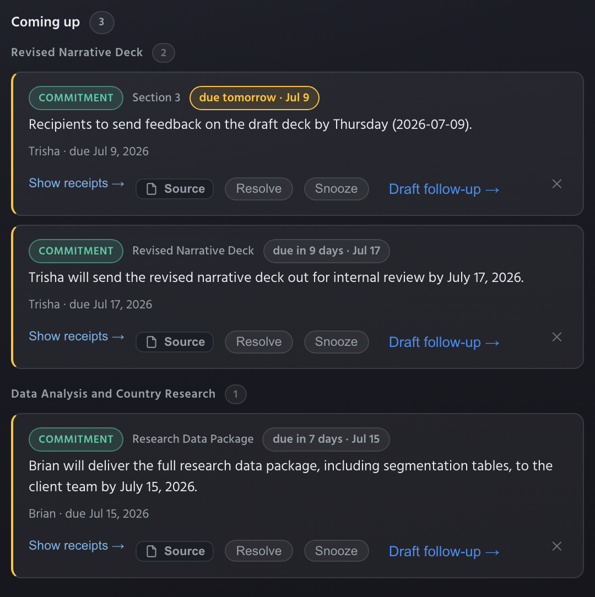

The badges tell you the state at a glance:

- **`due in 2 days · Jul 10`** — amber when due within 48 hours; the row takes
  the amber edge.
- **`quiet 9d`** — due soon *and* nobody has touched it in a while. Worth a
  nudge.
- **`no draft observed`** (amber) — the strongest warning: due soon and
  **nothing related has moved since it was promised**. This is the flag
  designed for the *"promised June 30th, nobody noticed until July 2nd"* miss —
  it appears *before* the deadline, while a heads-up to the client is still
  cheap.

Here's Coming up carrying those flags, with both draft actions:

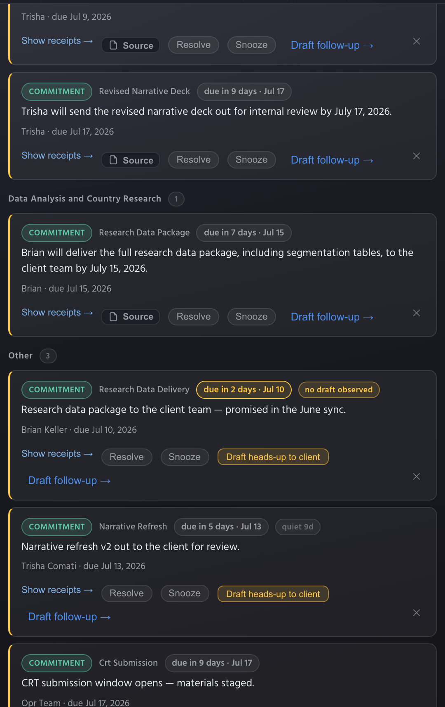

Each row carries: **Show receipts →** (the verbatim evidence behind the item),
**Source**, **Resolve**, **Snooze**, **✕** (dismiss), and — on flagged rows —
two drafts:

- **Draft heads-up to client** (amber): one tap stages a short, no-blame note
  to the client — *"Quick heads-up — [the deliverable] is due [date] and may
  need a few extra days. Flagging early so we can adjust the timeline together
  if needed."* The copy is composed for you, never mentions any internal
  signal, and lands in your Outbox for review. Clients accept lateness when
  warned early; this makes the warning one click.
- **Draft follow-up →** stages a nudge to the item's **owner** instead — chase
  internally, warn externally, whichever the moment needs.

When you have staged drafts, an **Awaiting send** tray appears in the rail —
review and send from there or from the Outlook add-in. **Nothing ever sends
itself.**

### 5.5 Needs attention (the worklist)

When nothing is waiting on your sign-off, Today shows the **Needs attention**
board: everything open that is blocked, overdue, or gone silent, grouped by
project into compact cards.

Each card shows its **worst item** on one line (`owner · due date · status`) —
the status word is amber for silence/overdue. Groups are ordered by their most
urgent item.

Click a card to expand its rows in place:

Rows carry the full toolkit: **Show receipts** (the quoted evidence and its
source), **Email** the owner, **Resolve**, **Snooze**, and **✕** (dismiss).

> The board appears when your Waiting-on-you queue is empty — the queue is
> always the first priority; the worklist is where you go once nothing is
> waiting on your sign-off.

### 5.6 Narrower windows and quiet mornings

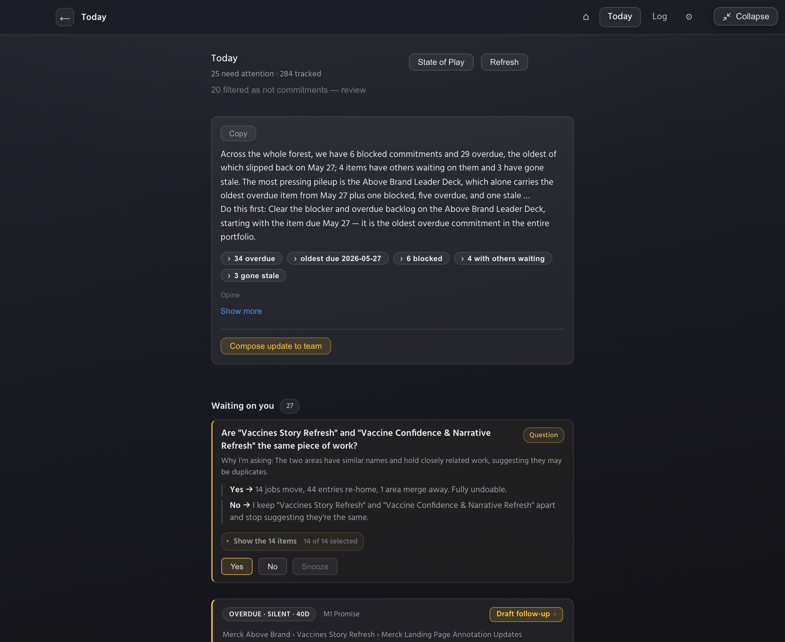

Below ~1200px everything stacks into one readable column in the same order:
state of play → waiting on you → coming up → needs attention. The Deadline
outlook's separate runway view drops out here, because Coming up already
carries the same facts in the single-column flow.

When there's nothing to report, Today says so **affirmatively** — every section
stays present with a calm line ("Nothing due in the next two weeks", "Nothing
overdue and silent. You're on top of it."). A quiet morning reads as good news,
not as a broken screen.

---

## 6. The Log

The chronological record: every decision and commitment captured, with type
chips (blue = decision, green = commitment), state pills (open / resolved /
replaced), owners, due dates, and receipts. Filter it **By project**, **By
deadline**, or **By person**, and switch between **All / Open / Resolved /
Replaced**. **Conflicts** surfaces statements in your record that disagree.

This is where you go to answer *"when did we decide that, and where's the
evidence?"* — project and person links cross-navigate, and every claim can show
its verbatim source quote.

---

## 7. Projects and project home

Projects group your work in the Log. Each project header carries live signals —
an **ON FIRE** flag when it's the hottest, a **State of play** expander for a
project-scoped narrative, and per-item **Open →** and **Move** actions to open
the item or reassign it to another project. Opening a project takes you to its
**project home**, where its records, people, and state of play live together.

---

## 8. Home

The landing surface after expanding: quick capture tiles (screen / file) and
the drop hint. Everything here is also reachable from the pill, so most days
you'll live in Today.

---

## 9. Settings

Settings is a master-detail screen: sections on the left rail, details on the
right.

### 9.1 Connection

Your workspace URL and access, with **Test connection**. Change these if your
server moves or your key rotates — the rest of the app picks the change up
immediately.

### 9.2 Integrations

- **OneNote** — the global send-current-page hotkey (Windows; default
  `Ctrl+Shift+O`), with Change/Reset.
- **Plaud** — connect your recorder account; sign-in happens in your browser
  and no credentials touch the app. Once connected, new recordings sync
  automatically. (Plaud sessions expire after about 7 days of no syncing —
  reconnect from here if the status drops.)
- **Outlook add-in** — install the add-in to capture emails and send staged
  replies, drafts, and meeting invites from inside Outlook. The manifest
  carries your connection, so the add-in arrives already configured — no token
  to paste.

### 9.3 Email capture

The personal capture-address panel — covered in full in section 4.

### 9.4 Privacy

Your data-sovereignty posture: what leaves your machine and where it's
processed. Review this with your administrator.

---

## 10. When the server is unreachable

Threshold fails *calm*, never loud:

- The widget keeps working — captures queue locally and the status dot goes
  soft red (never a modal, never a red alert).
- Today and the Log show their quiet states rather than error boxes.
- Reconnection is automatic; if your access expired, Settings → Connection →
  Test connection tells you.

---

## 11. Behaviors worth knowing

- **The pill** stays on top, on all Spaces, and never steals focus from the app
  you're working in.
- **Expanded**, Threshold behaves like any first-class app: ⌘⇥, Mission
  Control, native fullscreen, resizable. Collapse returns the pill to its
  remembered position.
- **One accent color:** amber always means *needs you* (counts, urgency badges,
  the one primary action). Everything else stays quiet by design.
- **Nothing auto-sends.** Every outbound draft (team updates, follow-ups,
  heads-ups) is staged to the Outbox for your explicit review.
- **Dismiss is reversible** and stays out of your views; Snooze durations live
  in the menu; "Replaced" marks superseded records in the Log.

---

*Screenshots live in `docs/user-guide-assets/` and are the real app rendered
against a live workspace. For installation, see `PILOT-INSTALL.md`.*
